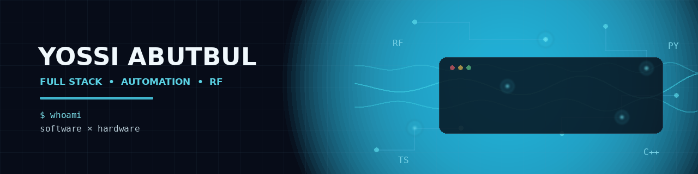

---

### About me

CS student who came into software through hardware. I spent years working
with RF systems and lab instruments, which is where I learned that most of
engineering is repetitive work waiting to be automated.

**Currently:** CS student + RF/automation work on the side

---

### Stack

---

### 🎮 Play My Game

Give it a shot — **Trump Jump: Strait of Hormuz**

---

### 📫 Contact

&nbsp;

