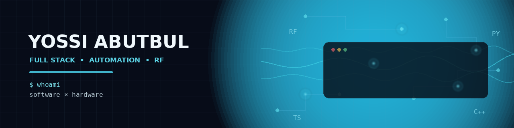

### I make hardware talk to software.

RF engineering taught me that most of the job is repetitive work waiting to be automated. 
Now I build the systems that do the repeating.

 

RF & Test Automation&nbsp;&nbsp;·&nbsp;&nbsp;CS Student&nbsp;&nbsp;·&nbsp;&nbsp;Open to Internships

 

## Selected work

<table>
<tr>
<td width="50%" valign="top">

#### 🎮 Trump Jump: Strait of Hormuz

A browser arcade game. No install, no loading screen, no
tutorial. Just reflexes and the compulsion to try once more.

**[Play it →](https://trump-jump-hormuz.vercel.app/)**

</td>
<td width="50%" valign="top">

#### 🗂️ Portfolio

Everything else, written up with the reasoning behind
it: what the problem was, what I tried, what broke.

**[Visit site →](https://yossiabutbul.vercel.app/)**

</td>
</tr>
</table>

## Claude Code mods

<table>
<tr>
<td width="50%" valign="top">

#### 📊 usage-band

A slim band above the Claude Code prompt showing how much
of your plan you've used: the 5-hour and weekly limits,
with progress bars and a countdown to each reset.

**[View repo →](https://github.com/YossiAbutbul/claude-usage-band)**

</td>
<td width="50%" valign="top">

#### 💧 water-reminder

The Claude critter pops up every hour, water bottle in
hand, and asks if you drank water. Say "not yet" and it
keeps asking every 5 minutes until you do.

**[View repo →](https://github.com/YossiAbutbul/claude-water-reminder)**

</td>
</tr>
</table>

## Toolkit

## Right now

- 📚 **Studying:** CS degree, currently deep in systems and data structures
- 🔧 **Building:** measurement pipelines and the web layers that make them readable
- 🌱 **Learning:** real time data handling, clean API design, and getting better at C
- 🔭 **Curious about:** embedded Rust, WebSerial, and browser based instrument control

 

**Open to internships and collaborations**, especially anything where hardware and software meet.

[abyossi22@gmail.com](mailto:abyossi22@gmail.com)

