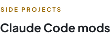
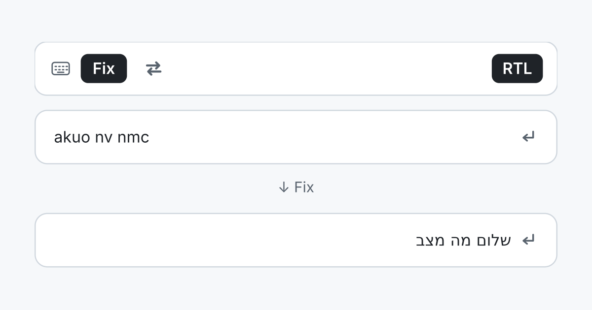
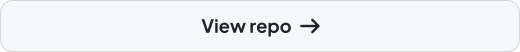
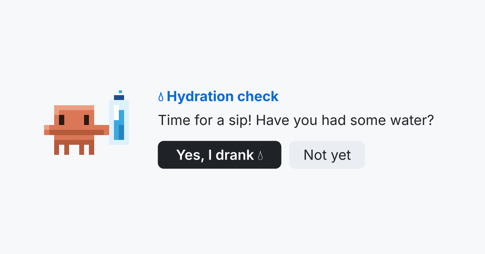
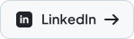
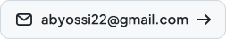

 

<picture>
  <source media="(prefers-color-scheme: dark)" srcset="assets/name-dark.svg" />
  
</picture>

R&nbsp;F&nbsp;&nbsp;&amp;&nbsp;&nbsp;T&nbsp;E&nbsp;S&nbsp;T&nbsp;&nbsp;&nbsp;A&nbsp;U&nbsp;T&nbsp;O&nbsp;M&nbsp;A&nbsp;T&nbsp;I&nbsp;O&nbsp;N&nbsp;&nbsp;&nbsp;·&nbsp;&nbsp;&nbsp;C&nbsp;S&nbsp;&nbsp;&nbsp;S&nbsp;T&nbsp;U&nbsp;D&nbsp;E&nbsp;N&nbsp;T&nbsp;&nbsp;&nbsp;·&nbsp;&nbsp;&nbsp;O&nbsp;P&nbsp;E&nbsp;N&nbsp;&nbsp;&nbsp;T&nbsp;O&nbsp;&nbsp;&nbsp;I&nbsp;N&nbsp;T&nbsp;E&nbsp;R&nbsp;N&nbsp;S&nbsp;H&nbsp;I&nbsp;P&nbsp;S

 

 

<a href="https://yossiabutbul.vercel.app/"><picture><source media="(prefers-color-scheme: dark)" srcset="assets/portfolio-card-dark.svg" /></picture></a>

 

<picture><source media="(prefers-color-scheme: dark)" srcset="assets/headings/mods-left-dark.svg" /></picture>

<table>
<tr>
<td width="50%" valign="top">

<a href="https://github.com/YossiAbutbul/altshift"><picture><source media="(prefers-color-scheme: dark)" srcset="assets/cards/altshift-card.svg" /></picture></a>

<a href="https://github.com/YossiAbutbul/altshift"><picture><source media="(prefers-color-scheme: dark)" srcset="assets/buttons/view-repo-lg-dark.svg" /></picture></a>

### altshift

A band above the Claude Code prompt for working in
Hebrew and English: Fix turns text typed on the wrong
keyboard layout into what you meant, and RTL shows
Hebrew chat right-to-left.

</td>
<td width="50%" valign="top">

<a href="https://github.com/YossiAbutbul/claude-water-reminder"><picture><source media="(prefers-color-scheme: dark)" srcset="assets/cards/water-reminder-card.svg" /></picture></a>

<a href="https://github.com/YossiAbutbul/claude-water-reminder"><picture><source media="(prefers-color-scheme: dark)" srcset="assets/buttons/view-repo-lg-dark.svg" /></picture></a>

### water-reminder

The Claude critter pops up every hour, water bottle in
hand, and asks if you drank water. Say "not yet" and it
keeps asking every 5 minutes until you do.

</td>
</tr>
</table>

 

<picture><source media="(prefers-color-scheme: dark)" srcset="assets/headings/toolkit-left-dark.svg" /></picture>

 

<picture><source media="(prefers-color-scheme: dark)" srcset="assets/contact/contact-left-dark.svg" /></picture>

<a href="https://www.linkedin.com/in/yossi-abutbul-550958199/"><picture><source media="(prefers-color-scheme: dark)" srcset="assets/contact/linkedin-dark.svg" /></picture></a>&nbsp;&nbsp;<a href="mailto:abyossi22@gmail.com"><picture><source media="(prefers-color-scheme: dark)" srcset="assets/contact/email-dark.svg" /></picture></a>
