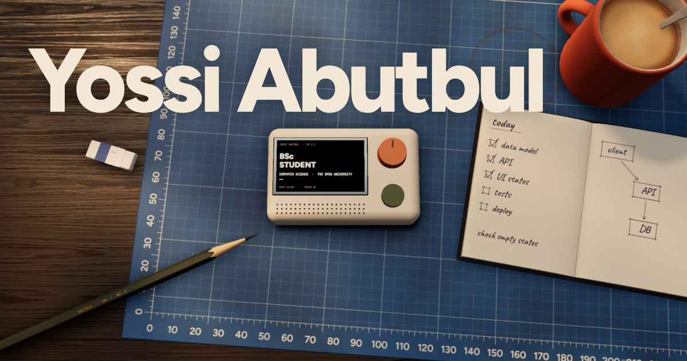
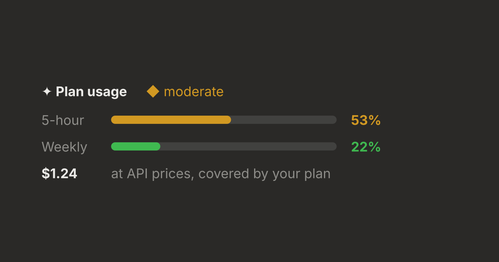
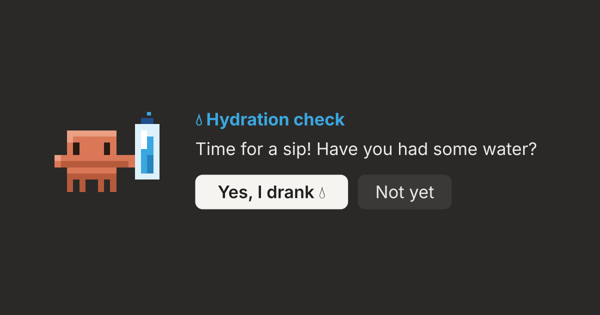

 

<picture>
  <source media="(prefers-color-scheme: dark)" srcset="assets/name-dark.svg" />
  
</picture>

R&nbsp;F&nbsp;&nbsp;&amp;&nbsp;&nbsp;T&nbsp;E&nbsp;S&nbsp;T&nbsp;&nbsp;&nbsp;A&nbsp;U&nbsp;T&nbsp;O&nbsp;M&nbsp;A&nbsp;T&nbsp;I&nbsp;O&nbsp;N&nbsp;&nbsp;&nbsp;·&nbsp;&nbsp;&nbsp;C&nbsp;S&nbsp;&nbsp;&nbsp;S&nbsp;T&nbsp;U&nbsp;D&nbsp;E&nbsp;N&nbsp;T&nbsp;&nbsp;&nbsp;·&nbsp;&nbsp;&nbsp;O&nbsp;P&nbsp;E&nbsp;N&nbsp;&nbsp;&nbsp;T&nbsp;O&nbsp;&nbsp;&nbsp;I&nbsp;N&nbsp;T&nbsp;E&nbsp;R&nbsp;N&nbsp;S&nbsp;H&nbsp;I&nbsp;P&nbsp;S

 

### I make hardware talk to software.

RF engineering taught me that most of the job is repetitive work waiting to be automated. 
Now I build the systems that do the repeating.

 

&nbsp;&nbsp;&nbsp;&nbsp;

 

## Selected work

<table>
<tr>
<td width="50%" valign="top">

### Trump Jump: Strait of Hormuz

A browser arcade game. No install, no loading screen, no
tutorial. Just reflexes and the compulsion to try once more.

<a href="https://trump-jump-hormuz.vercel.app/"><picture><source media="(prefers-color-scheme: dark)" srcset="assets/buttons/play-it-now-dark.svg" /></picture></a>

</td>
<td width="50%" valign="top">

### Portfolio

Everything else, written up with the reasoning behind
it: what the problem was, what I tried, what broke.

<a href="https://yossiabutbul.vercel.app/"><picture><source media="(prefers-color-scheme: dark)" srcset="assets/buttons/visit-now-dark.svg" /></picture></a>

</td>
</tr>
</table>

## Claude Code mods

<table>
<tr>
<td width="50%" valign="top">

### usage-band

A slim band above the Claude Code prompt showing how much
of your plan you've used: the 5-hour and weekly limits,
with progress bars and a countdown to each reset.

<a href="https://github.com/YossiAbutbul/claude-usage-band"><picture><source media="(prefers-color-scheme: dark)" srcset="assets/buttons/view-repo-dark.svg" /></picture></a>

</td>
<td width="50%" valign="top">

### water-reminder

The Claude critter pops up every hour, water bottle in
hand, and asks if you drank water. Say "not yet" and it
keeps asking every 5 minutes until you do.

<a href="https://github.com/YossiAbutbul/claude-water-reminder"><picture><source media="(prefers-color-scheme: dark)" srcset="assets/buttons/view-repo-dark.svg" /></picture></a>

</td>
</tr>
</table>

## Toolkit

 

**Open to internships and collaborations**, especially anything where hardware and software meet.

[abyossi22@gmail.com](mailto:abyossi22@gmail.com)

